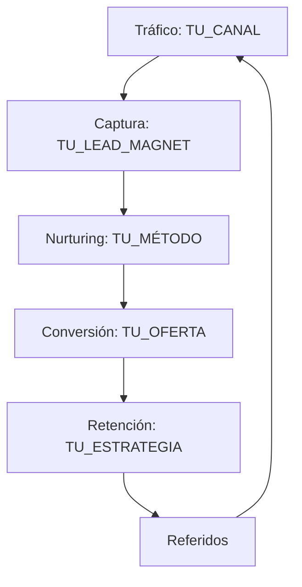

# EMBUDO DE CONVERSIÓN

> **Objetivo:** Diseñar el camino que sigue tu cliente desde que te descubre hasta que te compra (y te recomienda).

---

## 1. Vista General del Embudo

> Dibuja tu embudo con las etapas principales.

```
┌─────────────────────────────────────────────────────────────┐
│  TRÁFICO (¿Cómo te descubren?)                              │
│  [TU FUENTE PRINCIPAL DE TRÁFICO]                           │
└─────────────────────────────────────────────────────────────┘
                            ↓
┌─────────────────────────────────────────────────────────────┐
│  CAPTURA (¿Cómo los capturas?)                              │
│  [TU MECANISMO DE CAPTURA]                                  │
└─────────────────────────────────────────────────────────────┘
                            ↓
┌─────────────────────────────────────────────────────────────┐
│  NURTURING (¿Cómo los nutres?)                              │
│  [TU PROCESO DE NURTURING]                                  │
└─────────────────────────────────────────────────────────────┘
                            ↓
┌─────────────────────────────────────────────────────────────┐
│  CONVERSIÓN (¿Cómo compran?)                                │
│  [TU PROCESO DE VENTA]                                      │
└─────────────────────────────────────────────────────────────┘
                            ↓
┌─────────────────────────────────────────────────────────────┐
│  RETENCIÓN (¿Cómo los mantienes?)                           │
│  [TU ESTRATEGIA DE RETENCIÓN]                               │
└─────────────────────────────────────────────────────────────┘
```

---

## 2. Etapa 1: Tráfico (Descubrimiento)

### ¿Cómo te encuentra la gente?

**Canales de tráfico (ordenados por importancia):**

| # | Canal | Tipo | % del tráfico |
|---|-------|------|---------------|
| 1 | [CANAL] | [Orgánico/Pagado] | [X]% |
| 2 | [CANAL] | [Orgánico/Pagado] | [X]% |
| 3 | [CANAL] | [Orgánico/Pagado] | [X]% |

### Canal Principal: [NOMBRE]

**Estrategia:**
> [CÓMO GENERAS TRÁFICO EN ESTE CANAL]

**Contenido que atrae:**
> [TIPO DE CONTENIDO QUE MEJOR FUNCIONA]

**CTA en este canal:**
> "[TU CTA]"

**Métrica clave:**
> [QUÉ MIDES - ej. "Views", "Clicks", "Impresiones"]

---

## 3. Etapa 2: Captura (Lead Magnet)

### ¿Cómo capturas su información?

**Mecanismo de captura:**
- [ ] Newsletter / Email list
- [ ] Lead magnet (recurso gratis)
- [ ] Webinar / Masterclass
- [ ] Free trial / Prueba gratis
- [ ] Comunidad gratuita
- [ ] Consulta/Llamada gratis
- [ ] Otro: [ESPECIFICA]

### Lead Magnet (si aplica)

**Nombre del lead magnet:**
> [NOMBRE]

**Qué es:**
> [DESCRIPCIÓN - ej. "PDF de 10 páginas", "Mini curso de 3 videos"]

**Qué problema resuelve:**
> [PROBLEMA ESPECÍFICO]

**Por qué lo querrían:**
> [BENEFICIO PRINCIPAL]

**Dónde se entrega:**
> [EMAIL / ACCESO INMEDIATO / ETC.]

---

### Página de Captura

**URL:**
> [LINK]

**Headline:**
> "[TU HEADLINE]"

**Campos que pides:**
- [ ] Nombre
- [ ] Email
- [ ] Teléfono
- [ ] Empresa
- [ ] Otro: [ESPECIFICA]

**CTA del botón:**
> "[TEXTO DEL BOTÓN]"

---

## 4. Etapa 3: Nurturing (Cultivo)

### ¿Cómo calientas a tus leads?

**Canal de nurturing:**
- [ ] Email sequence
- [ ] Grupo de WhatsApp/Telegram
- [ ] Comunidad (Discord, Slack, etc.)
- [ ] Contenido exclusivo
- [ ] Webinars recurrentes
- [ ] Otro: [ESPECIFICA]

---

### Secuencia de Emails (si aplica)

| Día | Tema del Email | Objetivo |
|-----|----------------|----------|
| 0 | [TEMA] | [OBJETIVO - ej. "Entregar lead magnet"] |
| 1 | [TEMA] | [OBJETIVO - ej. "Contar tu historia"] |
| 3 | [TEMA] | [OBJETIVO - ej. "Educar sobre el problema"] |
| 5 | [TEMA] | [OBJETIVO - ej. "Presentar la solución"] |
| 7 | [TEMA] | [OBJETIVO - ej. "Hacer la oferta"] |

---

### Contenido de Nurturing

**Tipo de contenido que compartes:**
> [DESCRIPCIÓN]

**Frecuencia:**
> [CADA CUÁNTO]

**Objetivo:**
> [QUÉ QUIERES LOGRAR]

---

## 5. Etapa 4: Conversión (Venta)

### ¿Cómo compran?

**Modelo de venta:**
- [ ] Self-service (compran solos en la web)
- [ ] Llamada de ventas
- [ ] Webinar + Oferta
- [ ] Lanzamiento (puertas abiertas/cerradas)
- [ ] DM / Mensajes directos
- [ ] Otro: [ESPECIFICA]

---

### Página de Ventas

**URL:**
> [LINK]

**Estructura de la página:**
1. [SECCIÓN 1 - ej. "Hero + Headline"]
2. [SECCIÓN 2 - ej. "Problema"]
3. [SECCIÓN 3 - ej. "Solución"]
4. [SECCIÓN 4 - ej. "Beneficios"]
5. [SECCIÓN 5 - ej. "Testimonios"]
6. [SECCIÓN 6 - ej. "Oferta + Precio"]
7. [SECCIÓN 7 - ej. "FAQ"]
8. [SECCIÓN 8 - ej. "CTA final"]

---

### Proceso de Checkout

**Plataforma de pagos:**
> [STRIPE / PAYPAL / OTRO]

**Opciones de pago:**
- [ ] Pago único
- [ ] Suscripción
- [ ] Pagos divididos
- [ ] Otro: [ESPECIFICA]

**Bump / Upsell (si aplica):**
> [QUÉ OFRECES ADICIONAL]

---

## 6. Etapa 5: Retención

### ¿Cómo mantienes a tus clientes?

**Estrategia de retención:**
> [DESCRIPCIÓN]

**Comunicación post-compra:**

| Cuándo | Qué | Canal |
|--------|-----|-------|
| Día 0 | [ACCIÓN] | [EMAIL/OTRO] |
| Día 7 | [ACCIÓN] | [EMAIL/OTRO] |
| Día 30 | [ACCIÓN] | [EMAIL/OTRO] |
| Mensual | [ACCIÓN] | [EMAIL/OTRO] |

---

### Métricas de Retención

| Métrica | Meta |
|---------|------|
| Churn mensual | [X]% |
| LTV (Lifetime Value) | $[X] |
| NPS (satisfacción) | [X] |

---

## 7. Referidos / Viralidad

### ¿Cómo te recomiendan?

**Programa de referidos:**
- [ ] Sí, formal con incentivos
- [ ] Sí, informal (solo pido que recomienden)
- [ ] No tengo

**Incentivo por referir (si aplica):**
> [DESCRIPCIÓN]

**¿Qué hace que te recomienden naturalmente?**
> [RAZÓN]

---

## 8. Métricas del Embudo

### KPIs por Etapa

| Etapa | Métrica | Valor Actual | Meta |
|-------|---------|--------------|------|
| Tráfico | [MÉTRICA] | [VALOR] | [META] |
| Captura | Tasa de opt-in | [X]% | [X]% |
| Nurturing | Tasa de apertura | [X]% | [X]% |
| Conversión | Tasa de conversión | [X]% | [X]% |
| Retención | Churn | [X]% | [X]% |

### Embudo Numérico (ejemplo)

```
1,000 visitas/mes
    ↓ (3% opt-in)
  30 leads
    ↓ (30% abren emails)
  10 leads calientes
    ↓ (10% compran)
   1 cliente
    ↓ (x $[PRECIO])
  $[INGRESO] MRR
```

**Tu embudo:**
```
[X] visitas/mes
    ↓ ([X]% opt-in)
  [X] leads
    ↓ ([X]% engagement)
  [X] leads calientes
    ↓ ([X]% compran)
   [X] clientes
    ↓ (x $[PRECIO])
  $[X] ingresos
```

---

## 9. Herramientas del Embudo

| Etapa | Herramienta |
|-------|-------------|
| Landing pages | [HERRAMIENTA] |
| Email marketing | [HERRAMIENTA] |
| CRM | [HERRAMIENTA] |
| Pagos | [HERRAMIENTA] |
| Analytics | [HERRAMIENTA] |
| Chat/Soporte | [HERRAMIENTA] |

---

## 10. Diagrama Visual (Mermaid)

> Copia y pega este código en cualquier visualizador de Mermaid para ver tu embudo.



---

## Resumen del Embudo

**Tráfico principal:** [CANAL]

**Captura:** [MECANISMO]

**Nurturing:** [MÉTODO]

**Conversión:** [PROCESO]

**Retención:** [ESTRATEGIA]

**Métrica norte:** [LA MÁS IMPORTANTE]

---

## Notas Adicionales

[Cualquier otra observación sobre tu embudo]
